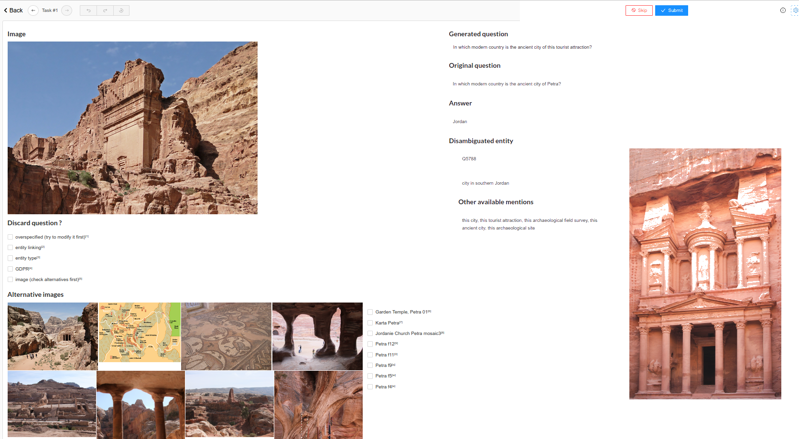

# Annotation

## Getting started
 

### Install [Label Studio](https://labelstud.io/)
Possibly in some virtual environment:  
`pip install label-studio==0.9.1`

(TODO fix the issue when an image is unavailable to allow label-studio 1.0)

### Download resources

Link | Description
-----|------------
https://mycore.core-cloud.net/index.php/s/l8sgKqAPvk0dfMr | 10 samples you can play with
https://mycore.core-cloud.net/index.php/s/GYH5XijwQ2j5Rpv | the same 10 samples annotated by PL
https://mycore.core-cloud.net/index.php/s/7ZhFObniOXf9PT7 | folder with only the interace, place your annotations (`tasks.json` file) there, like in the other folders

### run the project

`label-studio start eg_generations --user meerqat --password meerqat`

Don't worry too much about NumPy's deprecation warnings or Flask's "`WARNING: This is a development server. Do not use it in a production deployment.`"

This should open a new window in your favorite browser at http://localhost:8080/  
You should input the username and password you've set above (or don't set any)

Click on `Label`.

## Interface

- Skip button: **avoid its use** as for some reason, it will also mark this "task" as completed
 (although you will be able to sort tasks by number of skips then delete the fake completions)
- Submit button: hit it only when you're done
- Image is the image selected by the model that means to illustrate the Generated question
- Original question is the source from which we removed the explicit entity mention to replace it with an ambiguous one (Generated question)
- Generated question is **the** question that will end up in the dataset.
 This field is **editable** (so be careful) so that you can correct any potential errors (see below) **as long as it doesn't change the answer**
- Answer: the answer to both questions. Note there are actually multiple valid answers based on Wikipedia aliases.
 If the match between the **original question** and the answer seem strange, don't worry too much. 
- Disambiguated entity: entity QID, description and illustrative image on Wikidata. This should serve as a reference for spotting errors.
- Other available mentions: mentions extracted from Wikidata that might suit the entity. Can be used if the one selected is not appropriate (see below).
- Alternative images: 8 images along with their caption (left-to-right).
 You should tick the corresponding caption of the image you want to replace the question-image with (only if the latter is inappropriate obviously)
- Discard question: different reasons why you choose to discard the (image, question, answer) triple.
 **don't tick any of the boxes otherwise** (although you can tick and untick if you've made a mistake).

**Avoid using the "update" feature** or the "previous"/"next" arrows when you want to correct an error (it seems to save the initial "generated question" along your modifications). 
Instead delete the completion and hit "label" again.

## Common errors and how to fix them

original question | image | generated question | error category | explanation
------------------|-------|-------------------|----------------|------------
Which country is bordered by **Cambodia** and Laos to the west and China to the north? | - | Which country is bordered by **this sovereign state** to the west and China to the north? | *entity type* | Cambodia is a country, hard to illustrate thus it doesn't really fit our needs. These should have been filtered automatically but your annotation might allow to refine this filter.
Where did **Richard III** ‘imprison’ his two young nephews [...] |  | Where did **he** ‘imprison’ his two young nephews [...] | *image* |Image is related to the entity but doesn’t depict it directly. You should try to select an alternative image if possible.
When was **the president Barack Obama** born? |  | When was **he** born? |  *image* |Related issue: the entity is depicted but is not prominent. Although you can select an alternative image, you may get creative with the mention, e.g. "the man on the right". Avoid near-duplicates of the reference image. Also, if possible, avoid images where the entity name is written (e.g. plaque on a statue, photograph caption) although this might not be a problem or might be post-processed.
To within five years either way, in which year was the Boy Scout movement founded by **Robert Baden-Powell**?| - | - | *overspecified* | The original question is not really about Robert Baden-Powell so it doesn't make sense to illustrate it with him.
**Bonar Law** is the only Prime Minister not born in the UK. In which country was he born? | - | **He** is the only Prime Minister not born in the UK. In which country was he born? | *overspecified* |  Related issue, however here you are able to modify the question to make it more "visual" **as long as it doesn't change the answer**, e.g. simply keeping the last part "In which country was he born?"
Who plays **Han Solo** in Star Wars? |  | - | *GDPR* | In order to avoid having trouble with GDPR, we only use pictures of deceased celebrities thus questions about those have been filtered. However in this corner case we have a common folk who is *prominently* depicted in the image. Please select an alternative image if possible. (Note all images that have "cosplay" in their category have been filtered out but your annotation might provide useful new keywords).
Who founded **Stanford University**? |  |  Who founded **this open-access publisher**? | - | Although Stanford University *is* an open-access publisher, it is not its prime function, please edit the question by using another mention (you may use one available in "Other available mentions")
In the game of **Bingo**, ‘Get up and run’ represents which number?” | - | In the game of **this game of chance**, ‘Get up and run’ represents which number? | - | The whole "the game of Bingo" should have been replaced in the original question. Modify the question to make it grammatical.
If you landed at **'Santa Catarina Airport** on which Island would you be in? | - | If you landed at **this airport**? | - |Related issue: here, the parser removed *too much* of the original question, nothing a little copy-paste can't fix ;)

Last source of error: *entity linking*, e.g. [Washington, D.C.](https://www.wikidata.org/wiki/Q61) has been disambiguated as [George Washington](https://www.wikidata.org/wiki/Q23).

Please have a look at `eg_generations` to get familiar with the interface and try to reproduce the annotations in `eg_annotations`!
